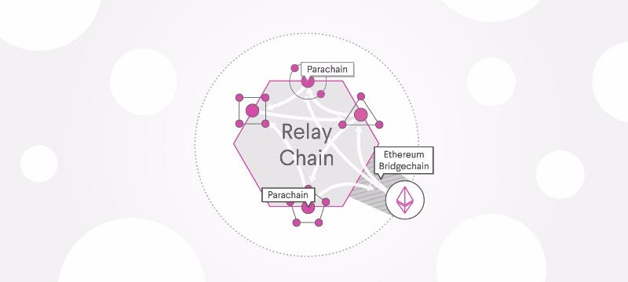

## Introduction

Polkadot is not just another blockchain; it's a paradigm shift in blockchain architecture. Unlike traditional monolithic blockchains, Polkadot envisions a future of interconnected chains, ushering in a new era of cross-chain interoperability.

Imagine a network where specialized blockchains, each optimized for specific tasks, seamlessly communicate and transact with one another. This is the essence of Polkadot.

Ready to dive into the world of Polkadot’s networking protocol? Let's explore the fundamental concepts, from network types to node roles, in a simple and intuitive manner.

<!-- truncate -->

## Networks and Nodes

When thinking about building a blockchain, it's useful to consider that boundaries are what define a network. For example, a set of computers connected to a single router can be considered a home network. A firewall might be the boundary that defines an enterprise network. Smaller, isolated networks can be connected to wider area networks through a common communication protocol. Similarly, you can think of a blockchain network as being defined by its boundaries and its isolation from or communication with other blockchains.

Polkadot, using Substrate, allows developers to create any type of blockchain and define its boundaries based on specific requirements. One crucial decision is the type of network you want to build and the role different nodes will play in that network.

## Network Types

Polkadot-based blockchains can be used in different network architectures, each with unique features and use cases.

### Private Networks

Private networks limit access to a restricted set of nodes. These networks are ideal for organizations that require control over who can participate in the network. They ensure privacy and can be customized to meet specific security and operational needs.

For instance, a financial institution might use a private network to conduct internal transactions securely. The control over participants helps maintain the confidentiality and integrity of sensitive data. Additionally, private networks can be tailored to comply with regulatory requirements, providing a flexible solution for enterprise needs.

### Solo Chains

Solo chains operate independently and implement their own security protocols. They don't connect or communicate with any other chains. Bitcoin and Ethereum are examples of solo chains. While robust, they do not benefit from the shared security and interoperability features of Polkadot.

Solo chains are like standalone applications. They are responsible for their own security, consensus, and operations. This independence can be beneficial for projects that require full control over their blockchain, but it comes at the cost of isolation from other blockchain networks.

### Relay Chains

Relay chains provide decentralized security and communication for other chains that connect to them. Kusama and Polkadot are examples. Relay chains act as the backbone of the network, offering security and consensus for connected parachains. This allows these parachains to focus on their specific functions without worrying about underlying security.

Relay chains are the heart of Polkadot's ecosystem. They manage the overall network security and facilitate communication between different parachains. By leveraging the relay chain's security, parachains can operate more efficiently and securely, enabling a diverse range of applications to coexist within the same network.

### Parachains

Parachains connect to a relay chain and can communicate with other chains using the same relay chain. Parachains depend on the relay chain to finalize blocks and must implement the same consensus protocol as the relay chain. This setup allows parachains to interoperate seamlessly, leveraging the relay chain's security while focusing on specialized tasks.

Parachains are specialized blockchains tailored for specific use cases. For example, one parachain might be optimized for decentralized finance (DeFi), while another might focus on supply chain management. The shared security model of the relay chain enables parachains to benefit from robust security measures without duplicating efforts, fostering innovation and efficiency.

## Node Types

Blockchains require network nodes to be synchronized to present a consistent and up-to-date view of the blockchain state. Each synchronized node stores a copy of the blockchain and keeps track of incoming transactions. However, maintaining a full copy of an entire blockchain requires significant storage and computing resources. To address this, there are different types of nodes that interact with the chain:

### Full Nodes

Full nodes are a critical part of the blockchain network infrastructure and are the most common node type. They store blockchain data and typically participate in common blockchain operations, such as authoring and validating blocks, receiving and verifying transactions, and serving data in response to user requests.

By default, full nodes store only the most recent 256 blocks and discard older state, except for the genesis block, to prevent indefinite growth and excessive disk space usage. They retain all block headers to validate the state and can rebuild the blockchain state by executing all blocks from the genesis block.

### Archive Nodes

Archive nodes are similar to full nodes but store all past blocks with complete state for every block. They are used by utilities—such as block explorers and wallets—that need access to historical information. Archive nodes require a lot of disk space but make querying past states faster and more efficient.

### Light Client Nodes

Light client nodes enable connection to a Substrate network with minimal hardware requirements. They can be embedded into web-based applications, browser extensions, mobile device applications, or IoT devices. Light client nodes provide a runtime and access to the current state through RPC endpoints but do not participate in blockchain or network operations and do not store past blocks.

## Node Communication and Maintenance

### Gossip Protocol

The gossip protocol is a decentralized communication method used by nodes to share information, such as transactions and blocks, with their peers. This protocol ensures that all nodes have a consistent view of the blockchain by propagating data throughout the network efficiently.

### Consensus Mechanisms

Polkadot uses Nominated Proof-of-Stake (NPoS) as its consensus mechanism. NPoS involves validators, nominators, collators, and fishermen to secure the network:

- **Validators**: Secure the relay chain by staking DOT and validating proofs from collators.
- **Nominators**: Back validators with their stake, helping to select reliable validators.
- **Collators**: Maintain parachains by collecting transactions and producing proofs for validators.
- **Fishermen**: Monitor the network and report malicious behavior.

## Network Maintenance

### Forkless Upgrades

Polkadot supports forkless upgrades, allowing the network to upgrade its protocol without creating a new chain or disrupting the ongoing operations. This capability ensures that updates can be deployed smoothly, enhancing the network's functionality and security.

### Governance

Polkadot features an on-chain governance system where stakeholders can propose and vote on network upgrades and changes. This system includes the Council, Technical Committee, and referendums, providing a decentralized and transparent decision-making process.

### Security Measures

Polkadot's security model involves shared security for parachains, where the relay chain provides robust security to all connected parachains. This model allows parachains to focus on their specific use cases while relying on the relay chain for overall network security.

## Comparing Full Nodes and Light Client Nodes

| Feature                | Full Nodes                                                                                  | Light Nodes                                                                                     |
|------------------------|---------------------------------------------------------------------------------------------|-------------------------------------------------------------------------------------------------|
| **Storage Requirements** | Full nodes store a complete copy of the blockchain, which can be extensive. This means they require significant storage capacity. | Light client nodes have minimal storage needs as they do not store the entire blockchain. Instead, they keep only the necessary information to verify the current state. |
| **Functionality**      | Full nodes perform a wide range of operations, including validating and relaying transactions, maintaining consensus, and serving data requests from other nodes and users. | Light clients are limited in functionality compared to full nodes. They primarily focus on verifying transactions and accessing blockchain data through RPC endpoints. |
| **Security**           | Full nodes offer a high level of security as they independently verify all transactions and blocks. This makes them less reliant on other nodes for data integrity. | While light clients are less secure than full nodes, they still offer sufficient security for most use cases by verifying only the necessary parts of the blockchain state. |
| **Network Participation** | Full nodes contribute to the overall network's health and security by participating actively in the blockchain's operations. | Light clients do not contribute to the network's consensus or operations. They are designed for ease of access and integration into lightweight applications. |

## Node Roles

Depending on the command-line options specified when starting a node, nodes can play different roles in the progression of the chain and provide different levels of access to the on-chain state. For example, you can limit which nodes are authorized to author new blocks and which can communicate with peers. Nodes can also be restricted to communicate with specific nodes.

## Where to Go Next

You can use Substrate to build virtually any type of network—from a completely self-contained and private solo chain to your own relay chain ecosystem or compatible parachains.

To take a deeper dive into networks and node types, explore the following topics:

- Build a local blockchain
- Simulate a network
- Add trusted nodes
- Authorize specific nodes

By understanding the basics of Polkadot’s networking protocol, you are well on your way to leveraging its powerful capabilities to build scalable, interconnected blockchain solutions.
